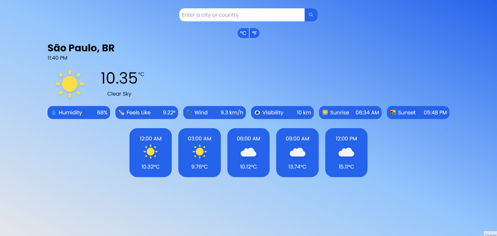

<h1 align='center'>Weather Web App</h1>
This app is able to search for a city, state/region, or country and exhibit the current weather data and forecast in a 3-hour gap. Developed with React.js and Tailwind CSS using OpenWeather API.

## Mobile Version

## Desktop Version

